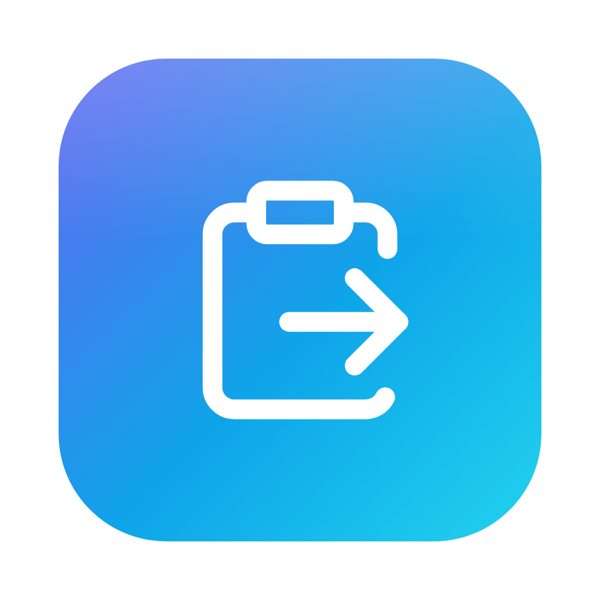

# mdpaste



Copy rich text anywhere, hit a hotkey, and it pastes as Markdown. A small Rust binary does the clipboard HTML -> Markdown conversion, writes the Markdown back to the clipboard, and simulates Cmd+V. As of v0.2 it runs **standalone**: `mdpaste daemon` listens for the hotkey itself — no Hammerspoon needed. Tested with tables, code blocks, nested lists, links, bold/italic.

Default hotkey: **Ctrl+Option+V** (Ctrl+Alt+V). Cmd+Option+V is avoided deliberately: Finder claims it for "Move Item Here" and JetBrains IDEs for "Introduce Variable" — the hotkey is global, so claiming it would silently break those apps.

## 1. Install prerequisites (one-time)

For the default setup there is exactly **one** prerequisite: macOS Accessibility permission, which you grant after install (see section 2b). No runtime dependencies, no Hammerspoon.

**Rust — only for building from source.** Skip entirely if you're using a prebuilt release:

```sh
curl --proto '=https' --tlsv1.2 -sSf https://sh.rustup.rs | sh
```

(`brew install rust` also works, but rustup is the standard way to manage Rust toolchains.)

**Hammerspoon — OPTIONAL (alternative trigger).** Only if you prefer Hammerspoon to own the hotkey instead of the daemon (section 3):

```sh
brew install --cask hammerspoon
```

## 2. Install the binary

**Option A — one-line install** (no Rust needed; macOS universal binary, runs on Apple Silicon and Intel):

```sh
bash -c "$(curl -fsSL https://raw.githubusercontent.com/iamfiscus/mdpaste/main/install.sh)"
```

This downloads the prebuilt binary from the latest GitHub release and the LaunchAgent (daemon) config, signs the binary, installs it to `~/bin`, installs the LaunchAgent, and starts the daemon — the same steps as running `install.sh` from a clone, minus the Rust build. It's idempotent: re-run it any time, including to upgrade. To pin a specific release asset instead of the latest, set `RELEASE_ASSET`, e.g. `RELEASE_ASSET=mdpaste-v0.1.0-macos-universal.zip bash -c "$(curl -fsSL .../install.sh)"`.

<details>
<summary>Alternative: download the binary by hand (if you'd rather not pipe a script into bash)</summary>

```sh
# from https://github.com/iamfiscus/mdpaste/releases (adjust version):
curl -L -o /tmp/mdpaste.zip https://github.com/iamfiscus/mdpaste/releases/latest/download/mdpaste-v0.2.0-macos-universal.zip
unzip /tmp/mdpaste.zip -d /tmp/mdpaste-bin
mkdir -p ~/bin
cp /tmp/mdpaste-bin/mdpaste ~/bin/
chmod +x ~/bin/mdpaste
xattr -d com.apple.quarantine ~/bin/mdpaste   # bypass Gatekeeper's "unverified developer" block (binaries downloaded unsigned from the web get this until notarized)
```

The `xattr` line is required once: mdpaste is not signed with an Apple Developer ID, so macOS would otherwise refuse to run it. (Files fetched with `curl` don't normally get the quarantine flag, but strip it anyway if macOS complains. If you'd rather not bypass Gatekeeper at all, use Option B and build it yourself.)

With the binary in place, run the downloaded `install.sh` (or drop a copy into an empty directory and run it there — it sees the existing `~/bin/mdpaste`, skips the download, and just signs it and sets up the daemon from section 2b).

</details>

**Option B — build from source + one-command setup** (needs Rust from section 1):

```sh
git clone https://github.com/iamfiscus/mdpaste.git
cd mdpaste
./install.sh
```

`install.sh` builds the release binary, copies it to `~/bin`, signs it, and installs + starts the daemon (section 2b) — everything below is done for you. If you'd rather do it manually, `cargo build --release && cp target/release/mdpaste ~/bin/` covers just the binary.

Note on paths: `~/bin` is not on your PATH by default. That's fine — the daemon is launched by absolute path. When running mdpaste by hand, use the full path: `~/bin/mdpaste`.

Note on signing: macOS keys the Accessibility grant to the binary's code signature, and an ad-hoc signature changes every rebuild — so a rebuilt binary silently loses its grant. `install.sh` signs with a persistent self-signed certificate named `mdpaste` if you have one in your login keychain (one-time: Keychain Access > Certificate Assistant > Create a Certificate… > Self Signed Root / Code Signing), and falls back to ad-hoc signing otherwise. Works either way; the cert just saves you re-granting after updates.

## 2b. Start the daemon

If you used `install.sh`, this is already done — it created the LaunchAgent plist at `~/Library/LaunchAgents/com.iamfiscus.mdpaste.plist` and loaded it, so `mdpaste daemon` starts at login and restarts if it crashes. That's true even for the standalone one-liner in section 2: when there's no repo checkout, `install.sh` downloads the plist template from the repo (with a built-in copy as fallback) before writing it. So once `install.sh` has run, the plist exists and the manual commands below work as-is. To load it by hand instead:

```sh
launchctl bootstrap "gui/$(id -u)" "$HOME/Library/LaunchAgents/com.iamfiscus.mdpaste.plist"
```

**What happens on first run — the one and only permission.** The daemon posts keystrokes itself, so it needs Accessibility. Because mdpaste is a plain binary (no app bundle), the permission entry is named after the executable — **"mdpaste"**, with a generic icon — in System Settings > Privacy & Security > Accessibility. On first launch the daemon asks macOS to prompt you; if no dialog appears, it falls back to printing instructions (check the log). Grant the permission and the daemon picks it up and starts listening — that's the whole onboarding. If you clicked **Don't Allow**, fix it by toggling "mdpaste" on in that list (no restart needed).

**Check it's alive:**

```sh
pgrep -f 'mdpaste daemon'
tail ~/Library/Logs/mdpaste.log
launchctl print "gui/$(id -u)/com.iamfiscus.mdpaste" | head
```

**After replacing the binary** (upgrade): re-run `./install.sh`, or reload the agent manually:

```sh
launchctl bootout "gui/$(id -u)/com.iamfiscus.mdpaste"
launchctl bootstrap "gui/$(id -u)" "$HOME/Library/LaunchAgents/com.iamfiscus.mdpaste.plist"
```

**Uninstall:** `./uninstall.sh` stops the daemon and removes the plist and binary.

## 3. Wire up the hotkey — OPTIONAL (Hammerspoon as alternative trigger)

Skip this entirely if the daemon from section 2b is running — it already owns Ctrl+Option+V. Use this only if you prefer Hammerspoon (e.g. you want Lua-level customization of the trigger). **Don't run both** — pick one owner for the hotkey.

1. Install and launch Hammerspoon once: `open -a Hammerspoon`. **This first launch is what creates `~/.hammerspoon/`** — it doesn't exist until then.
2. Copy the binding and load it (`install.sh` also does this automatically when `~/.hammerspoon` exists):

   ```sh
   cp hammerspoon/mdpaste.lua ~/.hammerspoon/
   echo 'require("mdpaste")' >> ~/.hammerspoon/init.lua
   ```

3. Menu bar icon > **Reload Config**.

**Permissions — in Hammerspoon mode, Hammerspoon needs two grants (instead of the daemon's one):**

1. **Accessibility** — System Settings > Privacy & Security > Accessibility > toggle Hammerspoon on. If the hotkey silently does nothing, toggle Hammerspoon off and back on in that list, then quit and relaunch Hammerspoon.
2. **Automation** — the *first* time you press the hotkey, macOS shows a prompt "Hammerspoon wants to control System Events". Click **Allow**; fix a denial at System Settings > Privacy & Security > Automation > Hammerspoon, or run `tccutil reset AppleEvents org.hammerspoon.Hammerspoon` to get re-prompted.

The Rust binary and its `osascript` calls run under Hammerspoon's process identity, so they inherit those grants.

## 4. Use it

Copy rich text, click into your target, press **Ctrl+Option+V**. The Markdown version of what you copied gets pasted.

## Troubleshooting

- **The hotkey does nothing (daemon mode).**
  1. Check the daemon is alive: `pgrep -f 'mdpaste daemon'` (nothing? reload it — see section 2b).
  2. Check the grant: System Settings > Privacy & Security > Accessibility must list **mdpaste**, toggled **on**. If you replaced the binary and it stopped working, the grant was revoked by the new signature — re-run `./install.sh` and re-grant (or use the self-signed cert to make the grant stick; see section 2).
  3. Check the log: `tail ~/Library/Logs/mdpaste.log`. The daemon says there whether it's listening or waiting on Accessibility.
  4. Debugging tip: run `mdpaste daemon` directly from a terminal and it checks Accessibility *for your terminal app*, not for the daemon — a trusted terminal can mask the daemon's own missing grant. Trust `launchctl print` + the log, and toggle "mdpaste" itself.
- **Running `mdpaste daemon` by hand exits with `mdpaste daemon already running (pid N). Refusing second instance.`** That's expected, not a bug: only one daemon may own the hotkey, and the LaunchAgent is already running one. To debug live in a terminal, stop the agent first, run the daemon yourself, then reload the agent when you're done:

  ```sh
  launchctl bootout "gui/$(id -u)/com.iamfiscus.mdpaste"
  ~/bin/mdpaste daemon        # runs in the foreground; Ctrl+C to stop
  launchctl bootstrap "gui/$(id -u)" "$HOME/Library/LaunchAgents/com.iamfiscus.mdpaste.plist"
  ```
- **"mdpaste: clipboard doesn't contain HTML (copy something rich-text first)"** means there's no HTML flavor on the clipboard — plain-text copies don't have one. Copy from a browser, rich-text editor, etc. (In Hammerspoon mode, if the alert instead says just "nothing to convert (copy rich text first)" with no details, something failed silently enough that even stderr was empty.)
- **`~/bin/mdpaste --dry-run`** does the conversion and copies the Markdown to the clipboard, but skips the simulated paste. Useful for checking what you'll get before pasting.
- **`~/bin/mdpaste --test FILE.html`** converts an HTML file and prints the Markdown to stdout. Works on any OS, so it's the fastest way to iterate on conversion bugs.
- **Permission failures are no longer silent (Hammerspoon mode)** — if the Automation prompt was denied or Accessibility is off, the binary's error message (captured from stderr) is shown in the Hammerspoon alert, e.g. an AppleScript "not authorized" error pointing at System Events.
- **iTerm2** may ask you to confirm multi-line pastes. Toggle "Confirm paste multiple lines" under Preferences > Advanced if you don't want the prompt.
- **Password fields and other secure-input contexts** silently drop synthetic keystrokes — macOS blocks them by design. The Markdown is still on your clipboard; press Cmd+V manually.

## Known limitations

- Note on the "tested" claim: the daemon's keystroke path is new in v0.2 — the paste simulation is the same macOS mechanism Hammerspoon used (synthetic Cmd+V into the focused app, subject to the same secure-input limits above), but the conversion feature matrix (tables/code/lists/links) was exercised via `--test`/`--dry-run`, not only through the hotkey.
- Copying a whole web page keeps nav bars, sidebars, and other site chrome — only tag-level junk (scripts, styles, etc.) is stripped for now; there's no readability-style main-content extraction.
- Code fences lose their language hints (```` ```rust ```` becomes a plain fence).
- Heading style may mix setext (`===`/`---` underlines) and ATX (`#`) within one paste.
- Some apps produce minor spacing quirks between inline elements (e.g. Slack timestamps abutting adjacent text).
- Blockquotes may pick up stray empty `>` lines around their paragraphs — an upstream `html2md` whitespace quirk; the quote's content and attribution are correct.
- The daemon's log (`~/Library/Logs/mdpaste.log`) is append-only with no rotation; truncate it if it grows.

## Cross-platform note

The binary compiles on Linux/Windows, but only `--test` works there as shipped. Clipboard *reading* uses the `arboard` crate and is already cross-platform; the real port points are `set_clipboard_text` (shells out to `pbcopy`), paste simulation, the hotkey listener/LaunchAgent in daemon mode, and the Hammerspoon binding in Hammerspoon mode. On Windows you'd write the Markdown back with the Unicode clipboard format, simulate paste with SendInput (e.g. the `enigo` crate), and use AutoHotkey (or a registered hotkey) instead.

## License

MIT — see [LICENSE](LICENSE).
